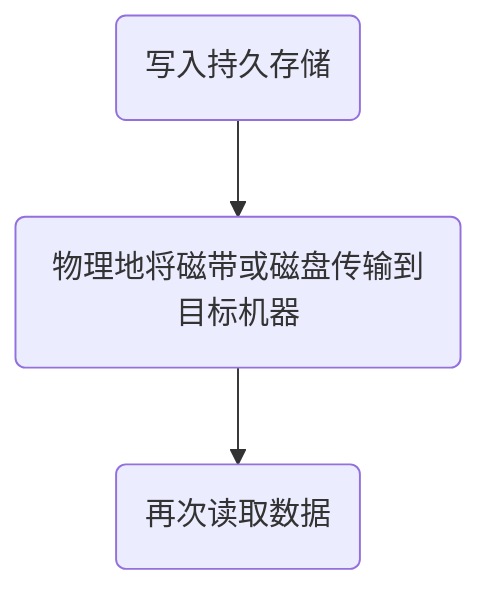

## 概念补充
- 数据：运送信息的实体
	- 模拟：连续
	- 数字：离散
- 信号：数据的电气的或电磁的表现
	- 模拟信号在一段时间内具有无限多个强度等级
	- 数字信号只能具有有限数量的定义值
	- 周期信号在一个可测量的时间范围内（称为周期）完成一个模式，并在随后的相同周期内重复该模式。
		- 一个简单的周期模拟信号，一个正弦波，不能被分解成更简单的信号。正弦波是由它的振幅、频率、相位来定义的
		- 复合周期模拟信号由多个正弦波组成
	- 非周期信号的变化没有表现出随时间重复的模式或周期
		- 大多数数字信号是非周期性的，因此周期和频率不是合适的特征
- 周期和频率的单位[[ch02.pdf#search=Units of period and frequency|ch02, p.6]]
- 链路传输术语
	- 单工&半双工&全双工
		- 单工：只能有一个方向的通信而没有反方向的交互
		- 半双工：通信的双方都可以发送信息，但双方不能同时发送/接收
		- 全双工：允许数据同时在两个方向上传输
	- 数据传输模式：在发送端，数字数据被编码成数字信号；在接收端，通过解码数字信号来重新生成数字数据（数字数据→数字信号→数字数据）
		- 并联
			- 8bits一起传（8条线）
		- 串联：8bits一个接一个地传（1条线）
			- 异步传输：信号的时间并不重要；按照商定的模式接收和翻译信息
			- 同步传输（允许延时）：信号的时间非常重要；一个接一个地发送比特，没有起始位、停止位或间隙。接收方有责任对比特进行分组
			- 等时传输（必须准时）
## 2.1 （被）导向的传输介质
Guided：信号的能量是被限制在介质的内部，沿着介质的物理结构传播，不能自由散播到空间中
### 2.1.1 永久存储设备
#### 一、永久存储
1.组成：磁性或固态存储器
2.传输数据的方式

3.对于高数据速率或每比特传输成本是关键因素的应用来说，具有成本效益
#### 二、带宽的简单计算
[[ch02.pdf#search=Simple Calculation of the Bandwidth|ch02, p.16]]
#### 三、成本的简单计算
[[ch02.pdf#search=Simple Calculation of the Cost|ch02, p.17]]
#### 四、移动大量数据的最佳解决方案
[[ch02.pdf#search=Best Solution for Moving Very Large Amounts of Data|ch02, p.18]]
### 2.1.2 双绞线
#### 一、应用
很常见;用于局域网LAN，电话线
#### 二、设计
1.扭转减少辐射信号（干扰）
2.捻线越紧，线材质量越高
#### 三、5e类双绞线
1.样式：[[ch02.pdf#search=Twisted Pairs|ch02, p.19]]
2.5e类双绞线由两根绝缘导线轻轻绞合而成。四对这样的电线通常被组合在一个塑料护套中，以保护电线并使它们保持在一起
#### 四、种类
1.第5类：适用于高速计算机通信，特别是100mbps和1gbps的以太网局域网
①用类似的电缆替换之前的3类电缆，使用相同的连接器，但每米有更多的扭转
②更多的扭曲导致更少的串扰和更好的信号质量在更长的距离，使电缆更多
2.第6类及以上的一些电缆可以支持10gbps的链路
3.第8类布线的运行速度比低类更快，但只能在30米左右的短距离内运行，因此只适用于数据中心
#### 五、主要的两类双绞线：UTP&STP
1.UTP：非屏蔽双绞线（第6类使用）
①接口：8个金属阵脚[[ch02.pdf#search=UTP-Connectors|ch02, p.22]]
RJ-45 Female（内凹）；RJ-45 Male（外凸）
2.STP：屏蔽双绞线（有金属盾牌）（第7类使用）：STP的存在确实是为了保护电线免受外部噪音的影响，以满足更苛刻的用途（更高的数据速率），但它更昂贵且难以使用
### 2.1.3 同轴电缆
#### 一、结构
1.优点：比双绞线更好的屏蔽；更长的距离；更高的速率；提供更多的带宽
2.结构（从外到内）：保护性塑料覆盖物；编织外导体；绝缘材料；铜芯[[ch02.pdf#search=Coaxial Cable (“Co-ax”)|ch02, p.23]]
#### 二、带宽：同轴电缆具有极宽的带宽
[[ch02.pdf#search=modern cables have a bandwidth of up to 6 GHz, – allowing many conversations to be simultaneously transmitted over a single coaxial cable (a single television program might occupy approximately 3.5 MHz).|ch02, p.24]]
#### 三、使用
1.曾在长途电话系统中广泛使用，但现在已在长途线路上被光纤所取代
2.仍然广泛用于有线电视和城域网MAN，也用于向世界许多地区的家庭提供高速互联网连接
#### 四、接口：BNC[[ch02.pdf#search=BNC Connectors|ch02, p.25]]
1.BNC公头
2.50欧姆BNC终端电阻器
3.BNC T接头
### 2.1.4 电力线
#### 一、电力线
1.通过使用抗频率受损和错误爆发的通信方案，在典型的家用电线上发送至少500 Mbps的短距离传输是可行的
2.使用电源线进行网络连接很简单。在这种情况下[[ch02.pdf#search=Power Lines|ch02, p.26]]，电视和接收器都插在墙上，这是必须要做的，因为它们需要电源。然后他们可以通过电线发送和接收电影
#### 二、通信和计算机技术的改进[[ch02.pdf#search=Improvement of Communication and Computer Technologies|ch02, p.27]]
### 2.1.5 光纤
#### 一、光纤
1.允许无限带宽
2.必须考虑成本：用于最后一英里的安装和移动bits
3.应用
①骨干网中的长途传输
②高速局域网LANs
③高速互联网接入
4.关键组成部分：光源+传输介质+探测器
5.传输系统采用物理原理
①图示：a展示了硅纤维中的一道光线以不同角度撞击空气/二氧化硅边界，b被全内反射捕获的光[[ch02.pdf#search=Fiber Optics (2 of 7)|ch02, p.29]]
②光通过光纤的传输：透过玻璃的光的衰减取决于光的波长，定义为输入与输出信号功率之比
#### 二、光纤电缆结构
与同轴电缆类似，只是没有编织层
#### 三、两种信号光源
1.LEDs发光二极管
2.半导体激光器
3.对比

|       | LED | 半导体激光器 |
| ----- | --- | ------ |
| 数据速率  | 低   | 高      |
| 光线类型  | 多模  | 多模or单模 |
| 传输距离  | 短   | 长      |
| 寿命    | 长   | 短      |
| 温度敏感性 | 小   | 大      |
| 成本    | 低   | 高      |

#### 四、光纤通信中不同波长的光信号衰减特性
1.光在不同波长下的衰减曲线[[ch02.pdf#search=Fiber Optics (4 of 7)|ch02, p.31]]
2.单位：光在红外波段通过光纤的衰减，用每公里损耗多少分贝（dB/km）来衡量
3.衡量标准：3dB 衰减=功率损失一半-如果一个信号在传输过程中功率减少了一半（即损耗因子为 2），那么这个损耗用对数公式表示就是[[ch02.pdf#search=10 log10 2 = 3 dB|ch02, p.31]]
#### 五、传播模式[[ch02.pdf#search=Fiber Optics (5 of 7)|ch02, p.32]]
1.单模传播
①特性：如此窄（10um）的光线甚至不能反射；与激光一起用于长距离，例如100公里
②光线：锯齿
2.多模传播
①特性：其他主要类型的纤维；光可以反射（50um芯）；与led一起使用，以获得更便宜，更短的距离链接
②多模阶跃指数光纤：曲线光线
③多模渐变指数光纤：水平光线
#### 六、接口[[ch02.pdf#search=Fiber-optic cable connector|ch02, p.34]]
1.SC接口：双方形
2.ST接口：双圆柱
3，MT-RJ接口：H型
#### 七、优缺点（相比铜芯）
1.优点
①处理更高的带宽
②不受电涌、电磁干扰、电源故障、腐蚀性化学品的影响
③又薄又轻
④不漏光
⑤难以敲击
2.缺点
①不太熟悉的技术，需要特定的工程技能
②纤维容易因过度弯曲而损坏
#### 八、携带的信息波
1.公式
$$
f = \frac{c}{\lambda}, \quad \Delta f = \frac{c \cdot \Delta \lambda}{\lambda^2} \qquad 
\left( c = 3 \times 10^8\, \mathrm{m/s},\ \lambda\ \text{in meters} \right)

$$
$\Delta \lambda = \frac{\Delta f \cdot \lambda^2}{c}$

2.e.g.需要在光纤上发送一系列计算机屏幕图像。屏幕是1024x768像素，每个像素是24位。每秒有60个屏幕图像。这个1.3微米的波段需要多少带宽？需要多少微米的波长？
每张图像数据量=1024×768×24=18874368bps

每秒传输数据量
=18874368×60=1132462080bps≈1132Mbps≈1080Mbps
假设每 1 Hz 带宽可以承载 1 bps 速率
频率带宽$\Delta f\approx$=1080MHz
代入公式得:
$$

\Delta \lambda = \frac{1.08 \times 10^9 \cdot (1.3 \times 10^{-6})^2}{3 \times 10^8}
= \frac{1.8252 \times 10^{-3}}{3 \times 10^8}
= 6.08 \times 10^{-12} \, \text{m}
= \boxed{6.08 \times 10^{-10} \, \mu\text{m}}
\

$$

## 2.2 无线传输
### 2.2.1 电磁频谱
电磁频谱及其在通信中的应用：
![[Pasted image 20251015141548.png]]
1.LF低频：30k-300kHz
2.MF中频：300k-3MHz
3.HF高频：3M-30MHz
4.VHF甚高频：30M-300MHz
5.UHF特高频：300M-3GHz
6.SHF超高频：30G-300G
7.EHF极高频：30G-300GHz
8.THF至高频：300G-3THz
### 2.2.2 跳频扩频
1.扩频：将原本占用较小频带的信号，扩展到更宽的频率带宽中进行传输
2.在跳频扩频中，发射机每秒从一个频率跳到另一个频率数百次
### 2.2.3 直接序列扩频
1.直接序列扩频使用编码序列在更宽的频带上传播数据信号
2.直接序列扩频和跳频扩频的对比
![[Pasted image 20251015150530.png]]

|       | 直接序列扩频                      | 跳频扩频                                        |
| ----- | --------------------------- | ------------------------------------------- |
| 频率分布  | 连续广谱                        | 离散频点跳变                                      |
| 抗干扰能力 | 频谱分布广→高                     | 难以预测频率→更高                                   |
| 保密性   | 好                           | 更高                                          |
| 应用    | CDMA                        | 蓝牙、早期军用通信                                   |
| 原理    | 把原始的低速数据信号用一个高速伪随机序列PN码进行调制 | 将信号分成多个调频周期，信号在每个调频周期被调制到一个新的由伪随机跳频序列决定的频率点 |

### 2.2.4 超宽频带
0.UWB（超宽带）通信发送一系列低能量的快速脉冲，改变它们的载波频率来通信信息。这种快速转变导致信号在很宽的频带上稀疏地传播
1.定义：超宽带定义为带宽至少为500mHz或至少为其频带中心频率的20%的信号
2.功能：在任何给定的频率下都有很大的带宽和很少的能量，UBM：
①通信速度快：可以以每秒几百兆的速度通信
②抗干扰强：能够承受来自其他窄带信号的大量相对较强的干扰
③不产生干扰：不会对其他窄带无线电信号造成有害干扰；不干扰同一频段的载波信号
3.应用：
①短距离室内应用，以及精确雷达成像和位置跟踪技术
②通过固体物体（地面、墙壁和身体）或作为精确定位系统的一部分进行成像
## 2.3 频谱用于传输
### 2.3.1 无线电传输
0.全向波；容易产生；传播距离长；穿透建筑物
1.路径损耗：在低频率下，无线电波可以很好地穿过障碍物，但随着距离源的远近，功率急剧下降。这种衰减称为路径损耗。
①在甚低频、低频和中频波段，无线电波跟随地球的曲率[[ch02.pdf#search=Radio Transmission|ch02, p.45]]
②在高频波段，它们从电离层反射回来[[ch02.pdf#search=Radio Transmission|ch02, p.45]]
2.无线电频谱的频率划分

| 频段名称   | 频率范围        | 传播方式    | 应用                 |
| ------ | ----------- | ------- | ------------------ |
| VLF甚低频 | 3-30kHz     | 地波      | 远距离无线电导航           |
| LF低频   | 30k-300kHz  | 地波      | 无线电信标，导航系统         |
| MF中频   | 300kHz-3MHz | 天波      | AM广播               |
| HF高频   | 3-30MHz     | 天波      | 民用无线电（CB）、海上/空中通信  |
| VHF甚高频 | 30-300MHz   | 天波+视距传播 | VHF电视，FM广播         |
| UHF特高频 | 300MHz-3GHz | 视距传播    | UHF电视、手机通信、寻呼、卫星通信 |
| SF超高频  | 3-30GHz     | 视距传播    | 卫星通信、微波通信          |
| EHF极高频 | 30G-300GHz  | 视距传播    | 雷达、高级卫星通信          |
**传播方式**
①地波：低于2MHz
电磁波沿地面表面传播
可绕过障碍物；波长较长，绕射能力强；信号衰减较大，适合短波远距离通信
②天波：2-30MHz
信号被电离层反射，实现“跳跃式”传播
可穿越非常远距离；会受日夜变化、太阳风等影响；适合跨国通信
③视距传播：高于30MHz
信号在发射天线和接收天线之间直线传播，不依赖反射
不能穿越障碍物，传播距离受限于视野范围；波长较短，适合高带宽通信
### 2.3.2 微波传输
0.定向波；需要中继器；不能穿透建筑物
1.微波有很大的带宽，广泛用于室内（WiFi）和室外（3G、卫星）
①信号被日常物品衰减/反射了
②由于多径衰落等原因,强度随迁移率的变化而变化
2.微波信号在传播过程中遇到多路径（直达；反射；散射/折射）传播现象的示意图[[ch02.pdf#search=Microwave Transmission|ch02, p.46]]
3.常用微波波段划分表

| 波段名称 | 波长范围      | 频率范围           |
| ---- | --------- | -------------- |
| 分米波  | 1m-10cm   | 300MHz-3GHz    |
| 厘米波  | 10cm-1cm  | 3GHz-30GHz     |
| 毫米波  | 1cm-1mm   | 30GHz-300GHz   |
| 亚毫米波 | 1mm-0.1mm | 300GHz-3000GHz |
### 例题
1.当天线的直径与无线电波的波长相等时，无线电天线通常工作得最好。合理的天线直径为1cm ~ 1m。这涵盖了什么频率范围
$c=3 \times 10^{8}m/s$
①$\lambda =1cm=1 \times 10^{-2}m$
$f=\frac{c}{\lambda}=\frac{3\times 10^{8}}{1× 10^{-2}}=3\times 10^10Hz=30GHz$
②$\lambda=1m$
$f=\frac{c}{\lambda}=\frac{3\times 10^{8}}{1}=3\times 10^{8}Hz=300Mhz$

2.当两个波相位差为 180°时，多路径衰落达到最大。一个 100 公里长的 1 GHz 微波链路中，两个信号路径之间需要有多大的路径差（path difference），才能导致最大的衰落？

解释：两个波若相位差为 180°，也就是半个波长（$\frac{\lambda}{2}$），则它们会相互抵消（波峰对上波谷），形成完全破坏性干涉，造成信号严重衰减或完全消失
$\lambda=\frac{c}{f}=\frac{3\times 10^{8}}{1\times 10^{9}}=0.3m$
$\Delta d=\frac{\lambda}{2}=0.15m$
### 2.3.3 红外传输
0.非导波；用于短距离通信；相对定向；便宜，容易建造；不穿透坚固的墙壁
### 2.3.4 光通信
0.非制导光通信
1.使用视距传播的光波（不使用光纤）可以建立通信链路
①原因：光是高度定向的，有很大的带宽
②通信系统中常用LED、摄像头、激光器、光电探测器实现收发
2.热对流会干扰激光通信系统
e.g.双向激光通信系统（热空气扰动形成的光学扰动区域使激光折射偏离）[[ch02.pdf#page=51|ch02, p.51]]
## 2.4 从波形到比特
### 2.4.1 数据通信理论基础
#### 一、正弦波的时域和频域图
1.简单正弦波的应用
①电力公司发送频率为60赫兹的单一正弦波，将电能分配给家庭和企业。
②当窃贼打开家里的门或窗时，使用一个单一的正弦波向安全中心发送警报。
2.同一个正弦波，在时间域和频率域下的图像不同[[ch02.pdf#page=54|ch02, p.54]]
纵轴：振幅
①时域表示：横轴是t，表示信号随时间的变化
曲线是一个频率为6 Hz、振幅为5V的正弦波
②频域表示：横轴是Hz，表示信号中包含哪些频率及其强度
红色竖线：表示在6Hz这个频率上，有一个振幅为5V的正弦波分量
3.三个频率分量的信号在时域和频域中的两种不同表示方式[[ch02.pdf#page=55|ch02, p.55]]
①时域表示：
- 红色：频率为0Hz，代表一个恒定电压（直流分量），振幅为15V
- 蓝色：频率为8Hz 的正弦波，振幅为10V
- 黑色：频率为16Hz的正弦波，振幅为5V
②频域表示：
- 频率为0Hz处（红线）：振幅为15V
- 频率为8Hz处（蓝线）：振幅为10V
- 频率为16Hz处（黑线）：振幅为5V
4.复合周期信号的分解[[ch02.pdf#page=56|ch02, p.56]]
振幅最大的波是基频
#### 二、傅里叶分析
用数学函数来表示电压或电流随时间变化的行为，使用傅里叶级数对周期信号进行展开
1.傅里叶级数展开
$$
g(t) = \frac{1}{2}c + \sum_{n=1}^{\infty} a_n \sin(2\pi nft) + \sum_{n=1}^{\infty} b_n \cos(2\pi nft)

$$
2.系数计算
$$
a_n = \frac{2}{T} \int_{0}^{T} g(t) \sin(2\pi nft) \, dt
$$
$$
b_n = \frac{2}{T} \int_{0}^{T} g(t) \cos(2\pi nft) \, dt
$$
$$
c = \frac{2}{T} \int_{0}^{T} g(t) \, dt
$$
#### 三、带宽受限信号
1.带宽受限信号的傅里叶逼近与失真分析：用一个二进制信号（比如字符b的编码）来展示这个信号在频域中是由多个正弦波分量组成的，如果传输信道无法完整传递所有频率分量（带宽有限），那么重建后的信号会失真
①信道的物理限制：数据通信中的信号都是有限带宽的信号，没有任何传输系统能传输完整的信号功率，因为带宽总是有限的
②失真：不同频率的傅里叶分量会被不同比例削弱
③衰减：超出信道截止频率`fc`的部分会被衰减
④信道的带宽越小，能传递的谐波越少，信号还原越差；信道的带宽越宽，能通过的谐波的次数就越高，接收端恢复的波形就越接近于原发送端的波形。相当于n越大，则傅立叶级数中前n项求和得到的值越接近于原来的周期函数
2.信号示意图&频谱图[[ch02.pdf#page=58|ch02, p.58]]
①a：
左边是字符b的二进制码：`01100010`，对应一个方波信号
右边是这个方波的傅里叶频谱（即频率分量的振幅图），以根号加权和的形式由多个谐波组合而成
②b：使用只有第1个谐波（基频）来近似原始信号
③c：使用前2个谐波（1f和3f）
④d：使用前4个谐波（1f,3f,5f,7f）
⑤e：使用前7个谐波，信号形状基本逼近原始方波
3.数据速率和谐波的关系[[ch02.pdf#page=59|ch02, p.59]]
①参数：
bps：传输速率b
T：每个bit的持续时间T$=\frac{1}{b}s=\frac{1000}{b}ms$
第一谐波的频率 f₁$=\frac{1}{2T}=\frac{b}{8}$
可发送谐波数：在3000Hz截止频率下最多可以通过的谐波数量$\frac{3000}{f₁}$（向下取整）
②结论：数据速率越高（bps越大），bit持续时间T越短，第一谐波频率f₁越高，传谐波数量越少，信号失真越严重
#### 四、带宽
1.定义：带宽是指一个信道能够传输的频率范围的宽度，且在这个范围内，信号不会被明显衰减
①实际中的带宽并不是截然分明的边界，所以通常把接收功率衰减到原始的一半的频率当作带宽上限
②带宽是传输介质的一种物理特性,它取决于传输媒介的物理特性，例如电线或光纤的结构、厚度、长度和材料
③信道能传的信息量只和带宽宽度有关，而不是起始/终止频率本身
2.基带信号和通带信号
①基带信号：信号从频率0Hz起，直到某个最大频率
②通带信号：信号被调制到某个较高频率区间（e.g.从3MHz到3.1MHz)
#### 五、非周期复合信号的时域和频域[[ch02.pdf#page=61|ch02, p.61]]
它可以是麦克风或电话机发出一两个单词时发出的信号。在这种情况下，复合信号不能是周期性的，因为这意味着我们在重复相同的单词或具有完全相同音调的单词
#### 六、模拟信号带宽[[ch02.pdf#page=62|ch02, p.62]]
模拟信号带宽=最高频率-最低频率
1.周期模拟信号（傅里叶级数）：离散频率
频域表示：离散
2.非周期模拟信号（傅里叶变换）：连续频率
频域表示：连续
#### 七、数字信号带宽[[ch02.pdf#page=63|ch02, p.63]]
基于傅里叶分析，数字信号是复合模拟信号，带宽是无限的
1.周期数字信号：离散频率
①时域表示：方波
②频域表示：离散
2.非周期数字信号：连续频率
①时域表示：方波
②频域表示：连续
#### 八、比特率
对于数字信号，比特率是一秒钟内发送的比特数，用比特每秒（bps）表示
M电平信号：每种电平代表的比特数=$log_{2}M$
比特率=波特率×每种电平代表的比特数
1.两电平信号：有两种电平（0，1），每种电平代表1个比特
若1秒内传输8个比特，比特率=8
2.四电平信号：有四种电平（00，01，10，11），每种电平代表2个比特
若1秒内传输8中电平状态，比特率=$8*2$=16
#### 九、带宽单位：赫兹or比特每秒
1.对电气工程师来说，（模拟）带宽是频率范围，单位是Hz
2.对电脑科学家来说，（数字）带宽是信道的最大数据速率，单位是bits/sec
3.数据速率是使用物理信道的模拟带宽进行数字传输的最终结果
### 2.4.2 信道的最大数据速率
#### 一、奈奎斯特定理（无噪声信道）
最大传输速率=$2*B*\log_{2}V bits/sec$
- **B**：带宽（Hz）
- **V**：每个符号的电平数（即信号的离散值种类）
- $log_{2}V$：每个符号可以携带的信息量（单位：bit/符号）

在无噪声的理想信道中，如果每秒最多传输$2B$个符号，并且每个符号能表达$log_{2}V$个比特，那最大比特率就是这个公式。
#### 二、香农公式（噪声信道）
最大传输速率=$B*log_{2}\left(1+\frac{S}{N}\right)bits/sec$
- **B**：信道带宽（Hz）
- **S/N**：信噪比，通常以**比值**而非dB表示

在存在噪声的实际信道中，香农定理给出了一个理论上限，告诉我们不能无限提升速率——受限于带宽和信噪比。
#### 计算时取这两个公式的计算结果的较小值
#### 例题
1.我们需要在带宽为20kHz的无噪声信道上发送265 kbps。我们需要多少信号电平？
$265*10^3=2*20*10^3*log_2V$
$log_2V=6.625$
$V=2^{6.625}$
由于这个结果不是2的幂，我们需要增加级别数或降低比特率。如果我们有128个级别，比特率是280kbps。如果我们有64个级别，比特率是240kbps。
2.每隔1毫秒采样一个10KHz的无噪声信道。最大数据速率是多少？
$采样频率=\frac{1}{1*10^{-3}}=10^3次/秒$
$总传输速率=采样速率*每次采样的比特数$
一个无噪声信道可以携带任意数量的信息，不管它被采样的频率有多高。每个样本都要发送大量的数据。题目没有给出每次采样的比特数，但本题特意说明是无噪声信道，所以允许通过每次采样多传bit来弥补采样频率低的问题。
题干中采样率不满足采样定理的最低要求，即采样率不低于带宽的2倍。$本题10^{3}<10*10^3$
3.奈奎斯特定理是适用于高质量单模光纤还是只适用于铜线？
奈奎斯特定理是数学的一个性质，与技术无关。它说的是如果你有一个函数，它的傅里叶谱不包含任何大于f的正弦或余弦函数，通过以2f的频率对这个函数进行采样你可以获得所有的信息。因此，奈奎斯特定理对所有介质都成立。
#### 三、普通电话线理论上的最高比特率
电话线通常有3000Hz（300到3300Hz）的带宽用于数据通信。信噪比通常为3162。
$C=B*log_{2}\left(1+\frac{S}{N}\right)=3000*log_2(1+3162)=3000*11.62=34860bps$
这意味着电话线的最高比特率为34.860 kbps。如果我们想要更快地发送数据，我们可以增加线路的带宽或提高信噪比。
#### 四、分贝
信噪比通常用分贝表示
假设SNRdB=36，信道带宽为2MHz。理论信道容量可计算为：
$SNR_{db}=10*log_{10}SNR$
$SNR=10^{\frac{SNR_{db}}{10}}=10^{3.6}=3981$
$C=B*log_{2}\left(1+\frac{S}{N}\right)=2*10^6*log_2(1+3981)=24*10^6bps=24Mbps$
如果SNR是以dB表示的，那么要先转换成普通比例值才能代入公式
#### 例题
考虑一个噪声极大的信道，其中信噪比的值几乎为零。换句话说，噪音太大，信号很微弱。对于这个通道，容量C计算为：
$C=B*log_{2}\left(1+\frac{S}{N}\right)=B*log_2(1+0)=B*log_21=B*0=0$
这意味着无论带宽如何，该信道的容量都为零。换句话说，我们无法通过这个通道接收任何数据。
#### 五、数据传输速率/比特率&信号速率/波特率
数据传输速率N（表示每秒传输的比特数）和信号速率S（表示每秒传输的信号元素个数）的关系：$S=\frac{N}{r}$
$每秒传输的信号元素个数=\frac{每秒传输的比特数}{每个信号单元携带的比特数}$
这个关系取决于r的值和数据模式：
1.r：一种比率，表示每个信号元素携带的比特数，即一个信号中包含多少个数据元素。比如r=2表示每个信号元素携带2个比特（00、01、10、11）
[[ch02.pdf#page=74|ch02, p.74]] r=1，1/2，2，4/3
r值越大，信号率越低，效率越高
2.数据模式：如果数据全是0或全是1，就不会有信号变化，导致信号接收端无法准确恢复出同步时钟或边界。因此信号模式的选择必须考虑数据模式；通常需要进行编码来保证信号有足够的跳变用于同步。
#### 六、平均信号速率
为了推导出这种关系的公式，我们需要定义三种情况：最差、最好和平均。
1.最差：最坏的情况是每个比特都需要一个新信号，信号变换频繁，信号速率最大
2.最好：最好的情况信号几乎不变，可以长时间保持同一信号，信号速率最小
3.平均：在数据通信中，我们通常对一般情况感兴趣
$S_{average}=c*N*\frac{1}{r}\quad baud$
①N：数据速率
②c：模式系数（坏1好0平均0.5）
③$\frac{1}{r}$：每个比特平均需要的信号变化数
#### 七、波特率&带宽
1.波特率，而不是比特率，决定了数字信号所需的带宽。如果我们用交通运输来类比，影响交通的是车辆的数量，而不是运载的人数。
①信号中更多的变化意味着向信号中注入更多的频率。
②带宽反映了我们需要的频率范围。
2.带宽（频率范围）与信号速率（波特率）成正比。
3.最小带宽$B_{min}=c*N*\frac{1}{r}$
①N：比特率
②r：每个信号元素携带的比特数
③$\frac{N}{r}$：信号速率
④c：模式系数
4.最大数据速率$N_{max}=\frac{1}{c}*B*r$
#### 八、奈奎斯特公式和Nmax公式一致吗
一个L级的信号实际上每级可以携带$log_2L$位,如果每个电平对应一个信号元素，我们假设是平均情况（c=$\frac{1}{2}$），则：
$N_{max}=\frac{1}{c}*B*r=2*B*log_2L$
奈奎斯特公式：最大传输速率=$2*B*\log_{2}V bits/sec$
### 2.4.3 数字调制
数字调制：比特与代表它们的信号之间的转换过程
#### 一、基带传输-信号占据了从0到最大值之间的全部频率
1.线路编码与解码
①基带传输：将数字数据直接转换为数字信号来传输，不进行调制。频率范围从0到某个最大值，该最大值取决于信号速率。常用于有线传输
②发送接收流程：数字数据→数字信号→数字数据
③r值
2.基带传输的线路编码方式：比特流→数字信号[[ch02.pdf#page=80|ch02, p.80]] [[ch02.pdf#page=89|ch02, p.89]]
①NRZ：1高0低
②NRZI：1翻转0保持
③曼彻斯特编码：异或
1：高→低
0：低→高
④AMI
0：用0表示
1：+V和-V交替表示
#### 二、带宽效率
带宽通常是一种有限的资源
解决方法：使用两个以上的信令级别
e.g.通过使用四个电压（00，01，10，11），我们可以一次发送2位作为单个符号（2B1Q）。只要接收器上的信号足够强，可以区分这四个电平，设计就可以工作。信号速率变化是比特率的一半，因此所需的带宽已经减少。
xByQ：每y个码元代表x个比特
符号率/波特率：信号变化的速率
比特率=符号率×每个符号的比特数
#### 三、时钟恢复
为了解码这些符号，信号需要足够的转换而不是长期保持0或长期保持1
方法：
1.曼彻斯特编码：在每个符号中混合时钟信号[[ch02.pdf#page=85|ch02, p.85]]
简单；使用两倍于数据信号的带宽
2.4B/5B编码：把每4位原始数据转换为5位编码[[ch02.pdf#page=86|ch02, p.86]]
每行不多于3个0（1s可以通过使信号电平改变来表示1来处理）；需要1.25倍带宽（设计为与NRZ-I结合使用）
3.Scrambler扰码器：把每4位原始数据转换为5位编码[[ch02.pdf#page=87|ch02, p.87]]
不需要额外带宽；使长时间的0或1成为低概率事件
#### 四、平衡信号
1.定义：指信号在一段时间内具有等量的正电压和负电压，其平均电压为 0，没有直流（DC）分量。
2.作用
①平衡有助于为时钟恢复提供过渡
②提供一种简单的方法来校准接收器
3.实现平衡信号的编码方式：双极编码
①编码规则：0表示零电压，+V和-V交替表示1，以保持电压平衡。
②单极和极性方案：[[ch02.pdf#page=83|ch02, p.83]]
（1）单极NRZ：1高0低
（2）极性：正电压代表一个逻辑值，负电压代表另一个逻辑值
- 极性RZ：每一位周期中间电平回到 0
- 极性NRZ-L：由电平表示值
- 极性NRZ-I：1反转0保持
（3）双极：0V表示为0，+V和-V交替表示1
- 双极AMI：0表示0V，1正负交替
- 双极伪三元：1表示0V，0正负交替
#### 五、通带传输-信号占据了载波信号频率周围的一圈频带
1.定义：一种通过调制将数字信号变成模拟信号的技术（信号占据的是一段频率范围），适用于无线和光纤通信等必须使用特定频段的传输方式
2.流程：数字数据通过调制器转换成模拟信号，再通过解调器还原成数字数据
3.数字调制方式[[ch02.pdf#page=91|ch02, p.91]]
①ASK调幅键控：根据信号是0还是1，改变正弦波的振幅  
- 当为`1`时：发送高振幅的正弦波
- 当为`0`时：振幅为0，信号几乎没有波形（也可以是低振幅）
②FSK调频键控：根据信号是0还是1，改变波形的频率
- `1` 时：高频波形（波更密）
- `0` 时：低频波形（波更稀）
③PSK调相键控：保持频率不变，通过改变波形的起始角度（相位）来表示 0 或 1
- 相位变化：波形在某些点突然转弯或翻转
- 每次数据变化（从0到1，或从1到0）就切换相位
4.星座图：用于可视化调制方式中信号的相位和幅度变化
①定义：一种用于表示调制信号中所有可能符号的图示
x轴表示同向分量，y轴表示正交分量
每个黑点代表一个符号，即某组比特的调制形式（对应一个具体的振幅+相位组合）
每个星座图上的点都表示一个独特的信号状态，它的坐标其实是由：
- 振幅（幅度）-决定这个点离原点有多远
- 相位（角度）-决定这个点在什么方向
这两个属性加起来，就能表示很多种不同的二进制组合（如 1011、0110）
②不同调制方式的星座图[[ch02.pdf#page=92|ch02, p.92]]
x个点-每个点表示$log_2x$个比特
（1）QPSK
- 4个点，每个点表示2个比特，例如：
    - 00 → 0° 
    - 01 → 90°
    - 11 → 180°
    - 10 → 270°
- 调制特征：
    - 振幅恒定
    - 相位只有4种，分别相差90°
- 优点：简单、抗噪声能力好
- 应用：广泛用于Wi-Fi、卫星通信
（2）QAM-16[[ch02.pdf#page=93|ch02, p.93]]
- 16个点，每个点代表4个比特（$2^4$=16）
- 使用不同相位和不同幅度
- 调制方式：相位+振幅同时变化
- 优点：比QPSK速率高（同样带宽传更多数据）
- 缺点：对噪声更敏感，需要更高的信噪比（SNR）
举例：
假设要发送`1011`
这4个比特一起组成了一个符号，在QAM-16中，每个符号刚好就能表示4个比特（4=$log_216$）
那么发送端会把这组 `1011` 映射到星座图上的一个点，比如说：角度 135°（相位）,振幅较高（离原点远），这个点亮了，代表发送了`1011`，接收端只要接收到这个点，就知道发的是`1011`，于是就完成了一次信号的调制和解调。
（3）QAM-94
- 64个点，每个点代表6个比特（$2^6=64$）
- 密度更高，调制精度更高
- 优点：单位时间传输的数据最多
- 缺点：
    - 非常容易受干扰
    - 接收端必须非常精准地判别每个点的细微差别
- 应用：高级别Wi-Fi（802.11ac）、数字电视（DVB）、LTE等
③sum：发射端把想要传的比特，转换成相位+振幅信息，用正弦波的形式发出去；接收端根据波形的特征（方向和强度）来还原发送的比特
④Gray编码的QAM-16星座图的解码错误[[ch02.pdf#page=93|ch02, p.93]]
假设准备通过 QAM-16 星座图发出 4 个比特 `1101`
在图上，`1101`对应于星座点A
发射端将它转换成一个带有特定振幅+相位的波形发送出去 
但是传输时，信号受到了干扰，于是发出了点A信号，接收端却检测到了A附近的其他点，也就是接收端看到的波形偏移到了点 B、C、D、E中的某一个
误码情况：

| 接收到的点 | 解码出的比特   | 和原始 `1101` 的差异 |
| ----- | -------- | -------------- |
| A ✅   | 1101（正确） | 0 个 bit 错      |
| B ❌   | 1100     | 第4位错了          |
| C ❌   | 1001     | 第2位错了          |
| D ❌   | 1111     | 第3位错了          |
| E ❌   | 0101     | 第1位错了          |

所以无论掉到A附近哪个点，只错了1个比特位
好处：每个点周围的点，都只和它相差1个比特，所以即使接收到的信号有轻微误差，最多也只错1bit，大大降低了误码影响
### 2.4.4 多路复用（频分、时分、码分、波分）
#### 一、FDM频分复用（模拟）
1.定义：把每个用户/信号分配到不同的频率带宽上，让它们可以同时传输，互不干扰
2.调制过程[[ch02.pdf#page=96|ch02, p.96]]：通过将信号乘上不同频率的载波来把每个信号搬到不同的频段，然后把调制后的多个信号合并在一起发送
3.OFDM正交频分复用：是一种高效的FDM技术，各个载波是相互正交的，每个载波在一个符号时间内有整数个载波周期，每个载波的频谱零点和相邻载波的零点重叠，这样便减小了载波间的干扰。由于载波间有部分重叠，所以它比传统的FDMA提高了频带利用率。用于802.11、4G蜂窝和其他通信。副航母被协调成紧密的包装
也就是当前的波的零点和相邻的两个波的波峰的横坐标相同→抵消为0
#### 二、时分复用（数字）
1.定义：随着时间的推移共享一个信道。用户按照固定的时间表轮流使用。广泛用于电话和单元系统。
2.同步时分复用&统计时分复用[[ch02.pdf#page=99|ch02, p.99]]

| 对比项      | 同步时分复用      | 统计时分复用    |
| -------- | ----------- | --------- |
| 时隙分配     | 固定          | 动态，按需     |
| 空数据线路    | 仍分配时隙（浪费）   | 不分配       |
| 是否需要地址字段 | 不需要（顺序已知）   | 需要（告诉是谁的） |
| 效率       | 较低          | 更高        |
| 实用性      | 静态设备（如电话交换） | 网络通信中更常用  |

#### 三、码分复用
1.定义：通过给用户一个代码来共享信道。码是正交的；可以同时发送。作为3G网络的一部分被广泛使用。
码：chip序列-由+1和-1组成的向量
正交性：任意两个码相乘再求平均（内积）= 0，即互不干扰

举例：

A=(-1 -1 -1 +1 +1 -1 +1 +1)
B=(-1 -1 +1 -1 +1 +1 +1 -1)
C=(-1 +1 -1 +1 +1 +1 -1 -1)
D=(-1 +1 -1 -1 -1 -1 +1 -1)

发送：
$S_1$=C=(-1 +1 -1 +1 +1 +1 -1 -1)
$S_2$=B+C=(-2 0 0 0 +2 +2 0 -2)
$S_3$=A-B=(0 0 -2 +2 0 -2 0 +2)
$S_4$=A-B+C=(-1 +1 -3 +3 +1 -1 -1 +1)
$S_5$+A+B+C+D=(-4 0 -2 0 +2 0 +2 -2)
$S_6$=A+B-C+D=(-2 -2 0 -2 0 -2 +4 0)

解码用户C的信号：对总信号和C的码做内积（点乘，逐项相乘再相加）再除以码长8
$S_1·C$=[1+1+1+1+1+1+1+1]/8=1
$S_2·C$=[2+2+2+2]/8=1
$S_3·C$=[2+2-2-2]/8=0
$S_4·C$=[1+1+3+3+1-1+1-1]/8=1
$S_5·C$=[4+2+2-2+2]/8=1
$S_6·C$=[2-2-2-2-4]/8=-1
+1：用户C发的是1
-1：用户C发的是-1
0：用户C没发
#### 四、波分复用（模拟）
1.定义：不同用户的数据通过不同的光波长λ来区分，并在同一根光纤中同时传输
2.光谱视图[[ch02.pdf#page=101|ch02, p.101]]：将4根光纤中的波长合并到1根共享光纤中
3.传输结构图[[ch02.pdf#page=101|ch02, p.101]]：输入信号通过和波器合并为一束光，通过一根长距离光纤传输，到达后通过分波器和滤波器把不同波长的光拆分回不同的用户/通道
## 2.5 公共电话交换网络
### 2.5.1 电话系统结构
1.三种典型结构：全互联网络；集中式交换；二级层次结构[[ch02.pdf#page=104|ch02, p.104]]
2.三类主要组成部分
①本地环路：从端局进入家庭和公司的模拟双绞线
②中继线：连接交换局的超高带宽数字光纤链路
③交换局：电话呼叫在这里从一条中继线被接入另一条中继线，可以是电缆或光纤
3.长途电话的典型线路[[ch02.pdf#page=105|ch02, p.105]]
电话机1→本地环路→本地局1→长途连接干线→长途局1→高速光纤中继链路→中间中继交换→高速光纤中继链路→长途局2→长途连接干线→本地局2→本地环路→电话机2
### 2.5.2 本地回路：电话调制解调器、ADSL和光纤
#### 一、电话调制解调器
1.电话调制解调器：通过模拟电话线路传送数字数据，把数字信号↔模拟信号进行转换，在传统电话系统上传输网络数据。
2.用调制解调器拨号上网的路径：计算机对计算机的呼叫使用模拟和数字传输。转换是由调制解调器和编解码器完成的

电脑
→调制解调器（把电脑的数字信号→转换成模拟信号，发送到电话线）
→本地电话线（一段模拟铜线，连接到电话局）
→电话局（Codec编解码器，把模拟信号转换成数字信号）
→长途干线（光纤或数字链路）
→ISP互联网服务商
- ISP1：模拟线→Codec→Modem
- ISP2：数字线→高速链路
3.调制解调器标准[[ch02.pdf#page=108|ch02, p.108]]
①波特率：单位时间内传输的符号数
②每个符号携带的比特数
③传输速率Bps=波特率$*$每个符号携带的比特数
#### 二、数字用户线DSL
1.DSL：是一种利用传统电话线（铜线）来传输数字数据的宽带接入技术，在电话线中使用语音频率之外的更高频段传送数据，可以同时进行电话和上网
2.特点：使用POTS普通老电话服务没用的频段；电话和电脑可以接在同一根电话线上；速率受线路距离很大
3.带宽&距离[[ch02.pdf#page=109|ch02, p.109]]：距离越短，速率越高
4.ADSL2 是如何在频谱上划分不同用途[[ch02.pdf#page=110|ch02, p.110]]
x轴-频率，0-1100kHz，整个频率被划分为多个4kHz的子信道，共 256 个
①voice：0-4kHz，用于POTS传统电话语音通话
②上行：25kHz-138kHz，用户上传数据的频率范围
③下行：138kHz-1100kHz，ISP发给用户的数据（下载）的频率
y轴-信号功率，表示每个子信道的强度（信号占用该频率的能力）
5.家用ADSL宽带系统结构图
信号路径：
ISP 
↔DSLAM数字用户线接入复用设备（集中处理多个ADSL用户的数据和语音信号，将其分别送往 ISP 和语音交换网）
↔Splitter分离器（把一根电话线分成两部分，高频部分（ADSL信号）送往 DSLAM，低频部分（语音）送往电话交换机（管理语音呼叫））
/Codec编解码器（对语音进行编码/解码）
↔Telephone line铜线电话线（从电信局拉到用户家里的一根电话线，同时承载语音和ADSL数据）
↔NID住宅外墙上的接入盒子
↔Splitter分离器
↔用户家里的调制解调器/电话/电脑
#### 三、FTTx光纤
1.FTTx：通过光纤直接把网络拉到每一户家庭，从而实现超高速上网
2.特点：共享波长信道；使用无源光纤；不需要中途供电或放大器
3.光纤到户无源光网络[[ch02.pdf#page=112|ch02, p.112]]
①电信局端：运营商/ISP的机房，接入整个互联网的骨干网络
②λdown/λup：波长上下行【波分复用】
（1）λdown下行波长：从运营商发往用户的数据
（2）λup上行波长：从用户发往运营商的数据
③无源光分路器：不需要电源（passive）；把一根光纤分成多条用户光纤，使多户共享一根主干光纤的信号，也可反向将多个用户的信号合并上传到ISP
④用户家庭端：家通过光纤连接到分离器，可以同时上行下行收发数据
### 2.5.3 中继线和多路复用
#### 一、数字化语音信号
1.语音是模拟信号，但现代网络传输用的是数字信号，因此模拟语音信号要先转换成数字信号（使用编码器把模拟波形转为数字样本，使用解码器在另一端还原回来）才能通过TDM传输。
①最常用的语音数字化方法：PCM脉冲编码调制，通过采样→量化→编码来完成数字化，每个采样点的信号幅度会被量化成一个8位（二进制）整数=$2^8$=256个可能的幅度等级（0-255）
②压扩
（1）压缩：在量化前压缩信号的动态范围，避免大信号占太多资源、小信号丢失。
压缩后的量化曲线：μ-law和A-law，用来优化语音质量与比特数之间的平衡
（2）扩展：在接收端还原信号时进行反向处理
③把量化后的数字样本通过数模转换+平滑处理（滤波），重新变回连续的模拟语音信号

>流程：
>模拟语音信号（人说话）
      ↓
  编解码器（Codec）
      ↓
  采样（Sample）
      ↓
  压缩（Companding）
      ↓
  量化为8位数字（Quantization）
      ↓
  编码（PCM）
      ↓
  用TDM打包成帧传输
      ↓
  接收端解码/解压/播放
      ↓
  还原成模拟语音

2.PCM脉冲编码调制
①定义：将模拟信号转换为数字数据（数字化）的最常用技术
②步骤：采样→量化→编码
（1）采样：将连续变化的模拟信号按固定时间间隔进行截取（红色曲线→红色柱体），只保留每个时间点上的幅度。采样频率必须满足奈奎斯特定理-采样频率至少是信号最高频率的两倍）。
奈奎斯特定理：为了不丢失原始模拟信号的信息，采样频率必须≥原信号中最高频率的2倍
- 【注意】最高频率 ≠ 带宽
	- 最高频率：信号中存在的最高频率分量（相当于一个上限）
	- 带宽：最高频率和最低频率之间的间隔值
- 如果信号是低通信号，则带宽=最高频率。例如0Hz到4kHz的频率都存在，这时候最高频率就是4kHz，带宽也是4kHz
- 如果信号是带通信号，则带宽<最高频率。例如信号频率只出现在100kHz到120kHz，那么最高频率=120kHz，最低频率=100kHz，带宽=120kHz-100kHz=20kHz
（2）量化：对每个采样值进行离散化，也就是将其限制为有限个等级，比如256个等级（即$log_2256$=8bit表示）(直方图)
（3）编码：将每个量化后的值编码成二进制数
比如一采样值为第 5 级→编码成 00000101
最终得到一个二进制比特流

#### 二、T载波：电话网络上的多路复用数字信号
1.T1线路将多个语音信道数字化并合并传输
①采样周期=125μs
电话语音的最高频率大约在4kHz，所以按照Nyquist定理，采样频率要≥2×4000=8000Hz，对应采样周期125μs
2×4000Hz=8000samples/sec⇒1/8000=125μs
②采样速率=64kbps
每路通话被数字化后，每隔125μs采样一次，每次采样为8位
采样速率=$\frac{8}{125*10^{-6}}=64*10^3bps=64kbps$
③整个T1线路的比特率（每秒能发多少帧）=1.544Mbps
一根T1线路可以同时传输24路电话，每125μs会采集这24路电话各自的8位样本，即一个T1帧=24×8+1=193bits（+1：帧同步位）
总速率=$\frac{每帧193bits}{每帧时长125μs}=\frac{193}{125*10^{-6}}=1.544*10^6bps=1.544Mbps$

sum：PCM+TDM
①PCM
流程：采样→量化→编码
（1）采样
按照 Nyquist 定理，采样率需 ≥ 2×最高频率
所以$采样率=2*4kHz=8kHz$，即每秒采样8000次，对应频率为125μs    
（2）量化：将模拟幅度离散成若干等级
（3）编码：每个采样值用8比特（二进制）编码表示
所以一个语音通道的数据速率是$8000*8=64000bps=64kbps$
②TDM
所有24个语音通道的数字信号要合并成一条主干线传输，采用 TDM：每条语音线轮流占据一个时间片，把24条线的数据轮流发送出去，排成一个一个的帧，每帧中有24×8=192位语音数据+额外加1位帧同步位，所以每帧：192+1=193bits，而每秒8000帧，所以$总速率=8000帧/秒*193bit/帧=1544000bps=1.544Mbps$

2.T1帧结构[[ch02.pdf#page=117|ch02, p.117]]
每帧 193 bit，时间为 125μs；
前1位是帧同步位；
后192位被划分成24组，每组8位，对应24路电话；
每个通话的8位数据的前7位是语音数据，第8位是信令信息

3.T载波系统中，多路复用将多个低速信道合成高速信道的过程：T1→T2→T3→T4，即通过多路复用，把多个小的语音数据流（T1，每个 1.544 Mbps）打包成更大容量的载波，从而实现更高的传输速率。
①T1（1.544Mbps）：每个T1线路可以传输24个电话语音信道。图中有4个T1流输入，每个都是1.544Mbps。
②4:1复用→T2（6.312 Mbps）
把4个T1流合并成1个T2流，每个 T1 的数据被交叉穿插，比如`T1 #0 的第1帧 + T1 #1 的第1帧 + T1 #2 的第1帧 + T1 #3 的第1帧
速率提升为：
$4*1.544Mbps≈6.176 Mbps（再加上一些控制位，所以是6.312Mbps）$
③7:1复用→T3（44.736 Mbps）
把7个T2流复用成一个T3流,每个T2是
$6.312Mbps×7≈ 44.184Mbps,加上控制开销,T3=44.736Mbps$
④6:1复用→T4（274.176 Mbps）
把6个T3流复用成1 个 T4 流,每个T3是
$44.736 × 6 ≈ 268.416 Mbps,加上控制信息,最终为274.176Mbps$
4.美国和欧洲的电话线路标准
①DS系列&T系列（美国）

| DS等级 | T线  | 速率Mbps  | 支持语音通道数 |
| ---- | --- | ------- | ------- |
| DS-1 | T-1 | 1.544   | 24      |
| DS-2 | T-2 | 6.312   | 96      |
| DS-4 | T-3 | 44.736  | 672     |
| DS-4 | T-4 | 274.176 | 4032    |
②E系列（欧洲）

| E线  | 速率Mbps  | 支持语音通道数 |
| --- | ------- | ------- |
| E-1 | 2.048   | 30      |
| E-2 | 8.448   | 120     |
| E-3 | 34.368  | 480     |
| E-4 | 139.264 | 1920    |
E1的比特率：
每帧有32个时隙（每个8bit），其中30个用于语音通道，2个用于控制/同步等用途
$速率=\frac{(30+2)*8bit}{125μs}=2.048Mbps$
#### 三、光纤网络中多路复用技术：SONET/SDH
1.定义：SONET是一种同步光纤传输标准，用于将多个数字信号通过光纤进行高速传输。SDH是国际标准。
2.帧结构：固定，每一帧持续125μs。
①每帧总共810字节=810×8=6480位，相当于52Mbps的传输速率
②图解[[ch02.pdf#page=122|ch02, p.122]]
帧高为 9 行（Rows），宽为 87 列（Columns）。
前3列为overhead，也就是控制信息。
- Section overhead：最基础的帧识别和同步
- Line overhead：用于路径管理、监控
- Path overhead：用于识别不同的路径载荷，保证数据准确传递
其余84列是负载区，灰色部分为SPE负载包络。
图中展示的是两个连续的SONET帧背靠背，说明这种帧结构是周期性连续发送的。
3.数据负载在帧中位置是可变的，可以浮动以适应不同速率和时延的子信道数据，提供灵活性。
4.速率等级结构与数据传输能力
每往上一级速率提升，带宽是下一级的3倍；每一层都会增加一些额外的帧开销，即Gross≠User；整个体系从最低的STS-1（~50 Mbps）开始，到STS-768（~40 Gbps）为止，支持从低速到超高速的扩展能力

| SONET             | SONET   | SDH     | 数据速率Mbps | 数据速率Mbps  | 数据速率Mbps  |
| ----------------- | ------- | ------- | -------- | --------- | --------- |
| SONET 网络中的电信号传输速率 | 光信号传输速率 | 光信号传输速率 | 总速率      | 同步负载封装速率  | 用户实际可用速率  |
| STS-1             | OC-1    |         | 51.84    | 50.112    | 49.536    |
| STS-3             | OC-3    | STM-1   | 155.52   | 150.336   | 148.608   |
| STS-12            | OC-12   | STM-4   | 622.08   | 601.344   | 594.432   |
| STS-48            | OC-48   | STM-16  | 2488.32  | 2405.376  | 2377.728  |
| STS-192           | OC-192  | STM-64  | 9953.28  | 9621.504  | 9510.912  |
| STS-768           | OC-768  | STM-256 | 39813.12 | 38486.016 | 38043.648 |
总传输速率：包括负载和开销
实际用于装载数据的速率：去除部分控制开销
最终用户可用的数据速率：去除全部控制开销
### 2.5.4 交换
#### 一、电话系统的基本部分
1.局外部分（本地回路+中继线）
2.局内部分（交换机）
#### 二、两种不同的开关技术
1.电路交换：传统的电话系统
①图示[[ch02.pdf#page=126|ch02, p.126]]
图中显示的是传统电话通信方式，通过交换局建立一个完整的物理连接。从左侧的电话拨号开始，到右侧电话响铃为止，整条路径上会被打通出一条固定的物理通路（虚线所示）。在通信过程中，这条通路始终保持专用状态，直到通信结束才释放。
②事件发生的时间过程：建立连接、发送数据、拆除连接
从A→B→C→D发起通话：
呼叫请求信号：用户发起通话，信号从A开始传向D，这一路上需要找一条空闲链路，从AB→BC→CD，中间可能会中继忙，需要等
→通话接收信号：当接收方D接起电话，系统从D向A发送接通信号
→正式通信：连接建立完成后，数据就开始源源不断地发送，没有中断、没有延迟
→拆除连接：通信结束后需要释放资源

2.数据包交换：IP语音技术
①图示[[ch02.pdf#page=126|ch02, p.126]]
图中显示的是两台计算机通过网络发送数据的过程。数据被分割为一个个数据包。每个数据包独立地经过多个交换设备，可能走不同的路径，最终抵达目的地。到达目标计算机后，这些数据包会重新排序并组合还原成原始数据。
②事件发生的时间过程
从A→B→C→D发送3个分组Pkt1-3：
没有连接建立阶段，数据包一开始就可以发送。
每个包（Pkt）独立发送，每一跳都可能遭遇不同的延迟。
延迟：
- 传播时延：指电磁信号在介质中传播所需时间，例如光纤中光速传播
- 排队时延：如果某个节点此时很忙，分组需要等待
包1、2、3到达各个中间节点的时间不同，最后一个节点（D）处存在排队（pkt3最后才到），所以传输时间不确定、不连续。
3.对比

| 对比项    | 电路交换                         | 分组交换                    |
| ------ | ---------------------------- | ----------------------- |
| 连接建立   | 必须事先建立一条完整的物理路径              | 无需建立连接，每个分组独立传输         |
| 传输路径   | 一旦建立连接，专用通道为整个会话保留           | 每个分组可以选择不同的路径前往目的地      |
| 资源分配   | 网络资源（带宽、路径）为该连接独占            | 网络资源按需使用，共享带宽           |
| 传输延迟   | 初始有建立连接的固定延迟，之后传输延迟较低，无排队延迟  | 无建立连接的延迟，但存在传播延迟与排队延迟   |
| 数据传输过程 | 数据持续、平滑地流动                   | 数据被切分为分组，逐个发送，接收端需要重新排序 |
| 传输效率   | 对话期间即使无数据也占用通道               | 通道按需使用，利用率高             |
| 使用场景   | 传统语音通话、实时通信                  | 互联网通信                   |
| 设备交换行为 | 交换设备仅用于连接建立与释放，之后不参与数据处理     | 每个路由器/交换节点都要处理每个分组      |
| 示意图特点  | 图中显示虚线连接代表建立的一条连续通路          | 图中显示分组在不同路径排队，顺序可能改变    |
| 时间图解   | 初期有呼叫请求信号、寻找路径等耗时步骤，后期数据持续传输 | 每个分组独立传播，有传播延迟和排队延迟     |

|             | 电路交换  | 分组交换/数据包交换 |
| ----------- | ----- | ---------- |
| 呼叫建立        | 需要    | 不需要        |
| 专用物理路径      | 有     | 没有         |
| 每个分组是否走相同路径 | 是     | 否          |
| 分组是否按顺序到达   | 是     | 否          |
| 交换机崩溃是否致命   | 是     | 否          |
| 带宽          | 固定的   | 动态的        |
| 可能拥塞的时间点    | 连接建立时 | 每个分组都可能    |
| 是否可能浪费带宽    | 是     | 否          |
| 是否使用存储转发机制  | 否     | 是          |
| 计费方式        | 按分钟   | 按字节        |
## 2.6 蜂窝网络
### 2.6.1 公共的概念：蜂窝、切换、寻呼
#### 一、蜂窝
1.定义：移动通信系统将覆盖区域划分为多个六边形的蜂窝，每个小区由一个基站提供服务。可划分为更小的蜂窝以支持更多用户
2.频率复用
①相邻小区不得使用相同频率，以避免干扰
②非相邻小区可复用相同频率，以提升频谱利用率
#### 二、切换
移动用户从一个蜂窝移动到另一个蜂窝时，系统必须将通信信道从当前基站转移到目标小区的基站
#### 三、寻呼
当系统要向某个用户发送信息时，会在各个小区内查找用户的位置
### 2.6.2 第一代（1G）技术：模拟语音
### 2.6.3 第二代移动电话（2G）：数字语音
### 2.6.4 GSM：全球移动通信系统
### 2.6.5 第三代（3G）技术：数字语音和数据
### 2.6.6 第四代（4G）技术：数据包交换
### 2.6.7 第五代（5G）技术

### G：
1G、2G、3G：提供模拟语音，数字语音，数字语音和数据（互联网，电子邮件等）
4G：物理层传输技术和基于ip的飞蜂窝；仅基于分组交换，没有电路交换
5G：支持高达20gbps的传输和更密集的部署；专注于减少网络延迟

## 2.7 有线电视
### 2.7.1 共用天线电视
### 2.7.2 线缆上的宽带Internet接入：HFC网络
### 2.7.3 DOCSIS
### 2.7.4 DOCSIS网络中的资源共享：节点和迷你槽

## 2.8 通信卫星
### 2.8.1 地球同步卫星
### 2.8.2 中地球轨道卫星
### 2.8.3 低地球轨道卫星

## 2.9 不同接入网络的比较
### 2.9.1 地面接入网络：有线电视、光纤和ADSL
### 2.9.2 卫星与地面网络

## 2.10 物理层上的政策
### 2.10.1 频谱分配
### 2.10.2 蜂窝网络
### 2.10.3 电话网络

